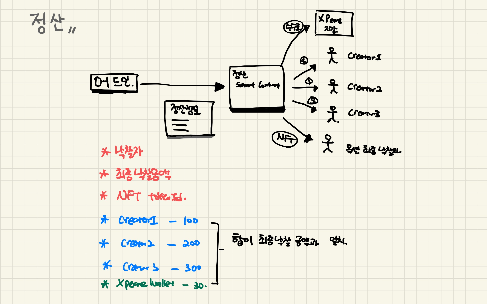

# Calculate Smartcontract code 

#### Caution

- 정산 받을 사람들의 수수료를 나눴을 때 정확히 떨어지지 않는 에러가 발생할 수 있음
  - 소수점 제한이 화면에 표시되는 것과 kXDT의 소수점이 다르기 때문 
  - 제한조건을 만들어줘야 함
- 함수를 실행하는 실행자에 대한 조건이 필요 (owner, 또는 어드민 계정)

#### Process

#### Action 

- 어드민페이지의 정산 페이지에서 옥션의 결과를 전달 받는다.(구매자, 최고 낙찰가, tokenId)
- 옥션 판매에 대한 수수료(xpeare) 를 입력 받는다.
- 수수료를 뺀 나머지 금액을 보여준다. 
- 정산 받을 주소를 입력 받는다. 
- 정산받을 각 주소에 대한 수수료를 입력 받는다.
- 각 주소에 보낼 수량을 계산한다. 
- (주소 : 토큰 수수료) 리스트를 만든다. 
- Creator 정산 완료 버튼을 클릭
  - 각 정산 받을 주소에 맞는 토큰 수량을 전송해준다.
- NFT 낙찰자에게 전송 버튼 클릭 
  - 최종 낙찰자에게 해당하는 NFT를 전송해준다.

#### Struct 

- **Creator Calculate**
  - 최종 낙찰 금액 (정산 받을 금액들의 합산 체크를 위해)
  - 거래 수수료(xpeare가 받는 금액)
  - 정산 받을 사람 리스트 (정산받을 지갑주소와 정산 받을 토큰 수량 매핑, xpeare wallet 지갑 주소 포함)

- **Creator Calculate**
  - 낙찰자 (NFT 받을 사람)
  - NFT tokenId
  - 최종 낙찰 금액 (정산 받을 금액들의 합산 체크를 위해)

#### Event

- 정산 금액 전송 
- NFT 전송 

#### Function

- creator에게 정산 금액 전송
- 최종 낙찰자에게 NFT 전송 

#### Mapping

